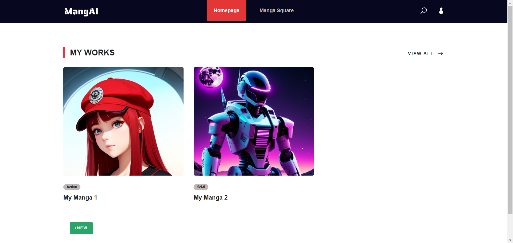
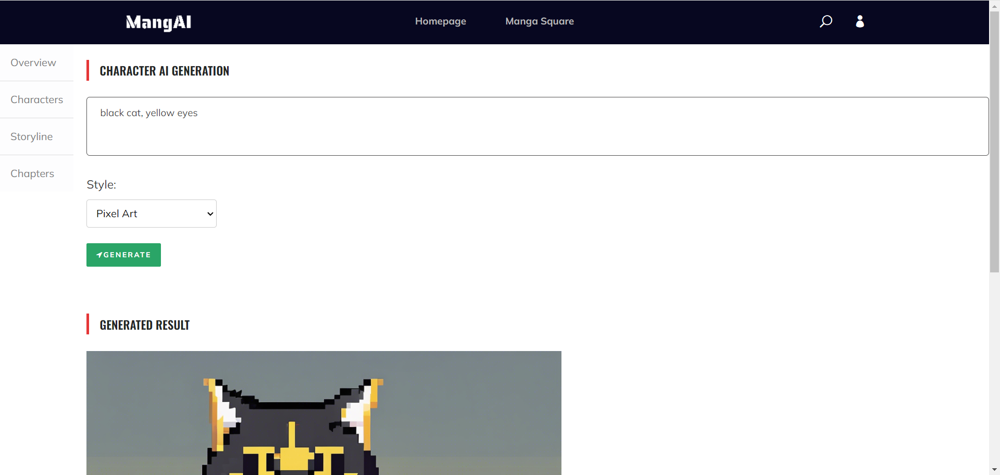
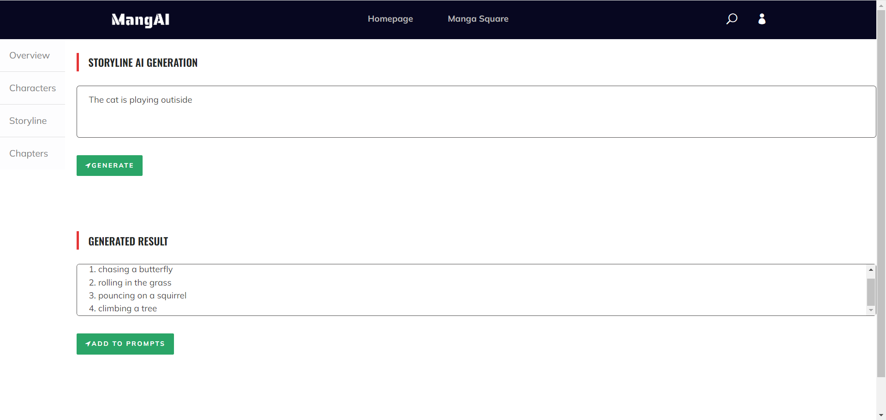
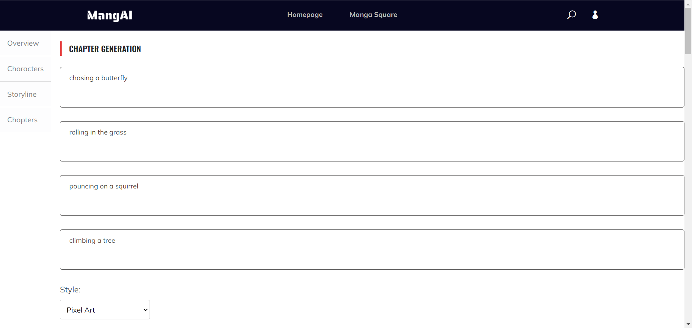
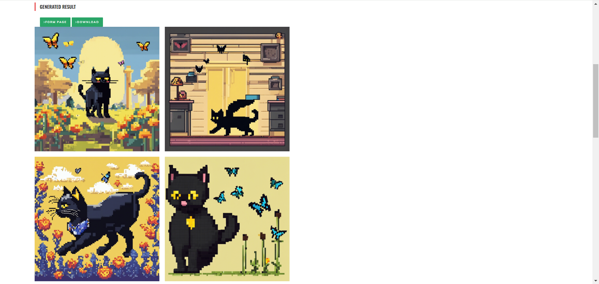
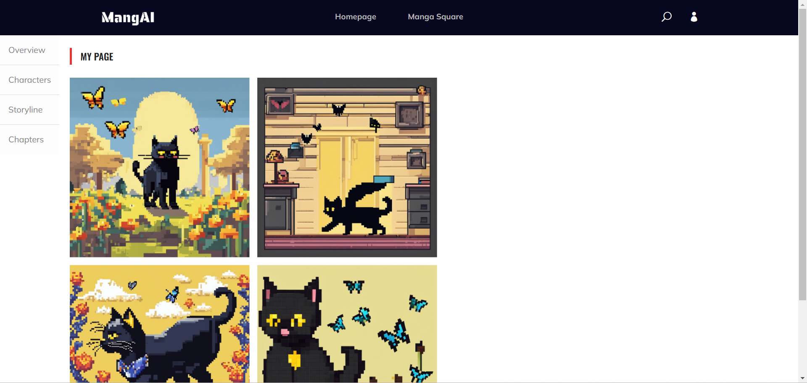

# MangAI (ECE209 HCI Project)

## Abstract
MangAI is an AI-assisted tool crafted to empower users, regardless of their professional manga creation expertise, to bring their personalized manga stories to life. It seamlessly aids users in designing manga characters, crafting story abstracts, and generating manga frames based on the established storyline and characters.

## Usage

1. **Homepage UI:**
   - Users can see their works or create new ones.
   - Click on one of the works to edit it.
   - 

2. **Character design:**
   - Input some key words about the character you want to design and also choose a style.
   - Click on `GENERATE` and then the the web app will fetch a stable diffusion model to create a desired character.
   - 

3. **Storyline generation:**
   - Input simple abtract about the storyline of a manga page.
   - Click on `GENERATE` and then the web app will fetch a LLM to transform the abstract into 4 phrases, each corresponding to one frame of a page.
   - Click on `ADD TO PROMPTS` to copy to phrases to page generation part.
   - 

4. **Page creation:**
   - Based on the phrases generated previously, choose a style and click `GENERATE` to create four images for each frame of a manga page.
   - Click on `FROM PAGE` to converge the images into 1 page.
   - Click on `DOWNLOAD` to download the page. 
   - 
   - 

5. **Overview:**
   - Click on `Overview` on the sidebar to see the lastest content!
   - 

## Reference
https://themewagon.com/themes/free-bootstrap-4-html5-gaming-anime-website-template-anime/

